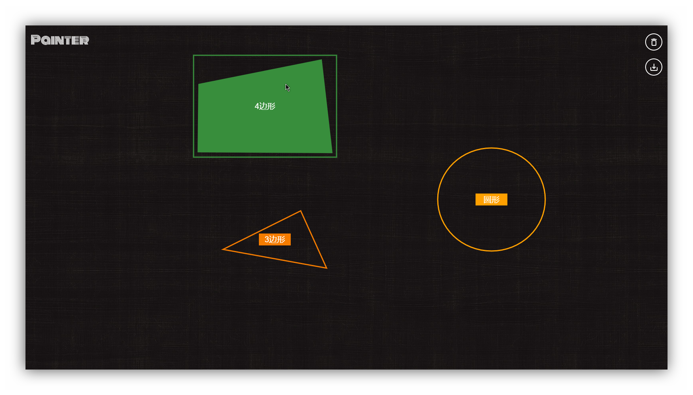

# Painter

> A simple hand painted board by vue

## Demo

click [here](https://sc-painter.netlify.com/) to see live example

## Screen Shot



## Features

1. Saving to local (You can restore it next time you open your brower)
2. Simple shapes identification

## Build Setup

```bash
# install dependencies
npm install

# code style analysis
npm run lint

# serve with hot reload at localhost:8080
npm run dev

# build for production with minification
npm run build

# build for production and view the bundle analyzer report
npm run build --report
```
